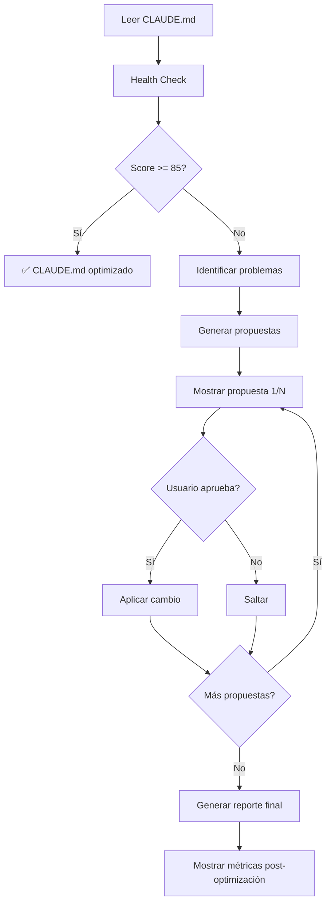

# Claude.md Maintainer

Skill especializada en mantener CLAUDE.md optimizado, conciso y consistente siguiendo las mejores prácticas oficiales de Claude Code.

## 📋 Contenido

1. [Cuándo Usar Esta Skill](#cuándo-usar-esta-skill)
2. [Filosofía de Mantenimiento](#filosofía-de-mantenimiento)
3. [Funcionalidades](#funcionalidades)
4. [Workflow de Optimización](#workflow-de-optimización)
5. [Referencias](#referencias)

---

## Cuándo Usar Esta Skill

Usa esta skill cuando necesites:

- **Analizar salud** de CLAUDE.md (métricas, score de calidad)
- **Detectar inconsistencias** entre skills/agentes documentados vs existentes
- **Identificar contenido delegable** (secciones extensas, detalles técnicos)
- **Optimizar descripciones** de skills/agentes (reducir verbosidad)
- **Validar referencias** (detectar links rotos, archivos inexistentes)
- **Refactorizar** CLAUDE.md siguiendo mejores prácticas

### Triggers de Invocación

El usuario menciona:
- "optimizar CLAUDE.md"
- "revisar CLAUDE.md"
- "analizar CLAUDE.md"
- "validar delegación"
- "limpiar CLAUDE.md"
- "CLAUDE.md está muy largo"
- "consistencia de CLAUDE.md"

---

## Filosofía de Mantenimiento

### Mejores Prácticas de Claude Code

Basado en documentación oficial de Anthropic y mejores prácticas de la comunidad:

1. **Tamaño Óptimo**: 100-200 líneas máximo
2. **Rol de CLAUDE.md**: Índice inteligente que delega, no enciclopedia
3. **Delegación sobre Duplicación**: Referenciar en lugar de duplicar
4. **Específico y Medible**: "Use 2-space indentation" vs "Format code properly"
5. **Mantener Actualizado**: Revisar cuando el proyecto evoluciona

### Principios de Delegación

**CLAUDE.md debe contener**:
- ✅ Comandos bash comunes del proyecto
- ✅ Reglas críticas (DB, workflows, convenciones)
- ✅ Referencias a skills/agentes (triggers + ubicación)
- ✅ Estructura de directorios
- ✅ Idioma y comunicación

**Delegar a archivos separados**:
- ❌ Detalles técnicos extensos (schemas, APIs)
- ❌ Documentación de implementación
- ❌ Ejemplos de código largos
- ❌ Información que cambia frecuentemente
- ❌ Secciones > 30 líneas

---

## Funcionalidades

### 1. Health Check (Análisis de Salud)

Genera reporte con métricas clave:

**Métricas Analizadas**:
- Líneas totales (target: 100-200)
- Número de secciones nivel 2 (target: 6-8)
- Skills documentadas vs existentes
- Agentes documentados vs existentes
- Comandos documentados vs existentes
- Referencias rotas
- Secciones extensas (>30 líneas)

**Score de Calidad** (0-100):
```
Score = (
  (100 - line_excess_penalty) +
  (100 - section_bloat_penalty) +
  (consistency_score) +
  (delegation_score)
) / 4
```

**Output Ejemplo**:
```markdown
## 📊 Reporte de Salud de CLAUDE.md

### Métricas Generales
- ❌ Líneas totales: 368 (rango recomendado: 100-200)
- ⚠️ Secciones nivel 2: 12 (recomendado: 6-8)
- ✅ Skills documentadas: 7/7 existen

### Score Total: 65/100
```

### 2. Detección de Inconsistencias

Valida consistencia entre CLAUDE.md y archivos del proyecto:

**Verificaciones**:
1. Skills documentadas existen en `.claude/skills/`
2. Agentes documentados existen en `.claude/agents/`
3. Comandos documentados existen en `.claude/commands/`
4. Skills/Agentes existentes están documentados
5. Referencias a archivos son válidas (no rotas)

**Output Ejemplo**:
```markdown
## 🔍 Inconsistencias Detectadas

### Skills
- ❌ `trace-generator` documentada pero NO existe en .claude/skills/
- ✅ Todas las demás skills documentadas existen

### Agentes
- ⚠️ `analyze-listing-qa-agent` existe pero NO está en CLAUDE.md

### Referencias
- ✅ Todas las referencias a archivos son válidas
```

### 3. Identificación de Contenido Delegable

Detecta secciones que deberían moverse a archivos separados:

**Criterios de Delegación** (Ver [rules/delegation-criteria.md](rules/delegation-criteria.md)):
- Sección > 30 líneas
- Contiene code blocks extensos
- Detalles técnicos (arquitectura, schemas, APIs)
- Información que cambia frecuentemente

**Output Ejemplo**:
```markdown
## 🎯 Contenido Sugerido para Delegación

### 1. Sistema de Traces de Inventario
- **Ubicación**: Líneas 236-279 (43 líneas)
- **Razón**: Detalles técnicos extensos
- **Destino**: `.claude/docs/architecture/traces-system.md`
- **Reducción**: De 43 a 3 líneas en CLAUDE.md

### 2. Variables de Entorno
- **Ubicación**: Líneas 301-321 (20 líneas)
- **Razón**: Duplica información de .env.example
- **Destino**: Link a `.env.example`
- **Reducción**: De 20 a 2 líneas
```

### 4. Optimización de Descripciones

Convierte descripciones verbosas de skills/agentes a formato compacto:

**Formato Objetivo** (3 líneas):
```markdown
#### `supabase-query`
**Triggers**: database, supabase, sql, migration, schema
**Ubicación**: `.claude/skills/supabase-query/` | 21 MCP tools + Schema completo
```

**Reducción**: De 6 líneas → 3 líneas por skill (50% menos)

### 5. Refactorización Interactiva

Ejecuta cambios con aprobación del usuario:

**Flujo**:
1. Muestra propuesta de cambio con diff
2. Pregunta: "¿Aplicar este cambio? [Sí/No/Ver diff]"
3. Si acepta: Ejecuta cambio
4. Si rechaza: Salta al siguiente
5. Genera reporte final de cambios aplicados

**Output Ejemplo**:
```markdown
## 🔄 Cambio Propuesto 1/5

### Optimizar descripción de 'supabase-query'

**Antes** (6 líneas):
#### `supabase-query`
**Cuándo usar**: Consultas DB, schema, migraciones
**Triggers**: database, supabase, sql
...

**Después** (3 líneas):
#### `supabase-query`
**Triggers**: database, supabase, sql, migration
**Ubicación**: `.claude/skills/supabase-query/` | 21 MCP tools

¿Aplicar este cambio? [Sí/No/Ver diff]
```

### 6. Generación de Archivos de Delegación

Crea automáticamente archivos de documentación separados con contenido movido:

**Estructura de archivos creados**:
```
.claude/docs/
├── architecture/
│   ├── traces-system.md      # Detalles técnicos movidos
│   └── optimizations.md       # Optimizaciones del sistema
├── setup/
│   └── env-vars.md            # Variables de entorno detalladas
└── reference/
    └── [otros archivos]
```

**Header de archivos generados**:
```markdown
# [Título]

> **Nota**: Documentación extraída de CLAUDE.md para mantener el archivo principal conciso.
> **Última actualización**: [fecha]
> **Origen**: CLAUDE.md líneas [X-Y]

[Contenido movido]
```

---

## Workflow de Optimización

### Flujo Completo (Modo Recomendado)

Cuando el usuario pide "Optimiza CLAUDE.md":



### Pasos Detallados

**1. Análisis Inicial**
```bash
# Leer archivo
Read CLAUDE.md

# Contar líneas
Bash: wc -l CLAUDE.md

# Listar skills existentes
Glob: .claude/skills/*/SKILL.md

# Listar agentes existentes
Glob: .claude/agents/*.md

# Listar comandos existentes
Glob: .claude/commands/*.md
```

**2. Detección de Problemas**

Aplica reglas de [rules/](rules/) para identificar:
- Secciones extensas (>30 líneas)
- Skills/agentes no documentados
- Skills/agentes documentados pero inexistentes
- Referencias rotas
- Formato verboso de descripciones

**3. Generación de Propuestas**

Para cada problema detectado, genera propuesta con:
- **Descripción**: Qué se va a cambiar
- **Razón**: Por qué es necesario
- **Diff**: Cambio exacto (antes/después)
- **Impacto**: Reducción de líneas

**4. Interacción con Usuario**

```markdown
## 🔄 Propuesta 1/5: Delegar "Sistema de Traces"

**Problema**: Sección extensa con detalles técnicos (43 líneas)
**Solución**: Mover a `.claude/docs/architecture/traces-system.md`
**Reducción**: 43 → 3 líneas (-40 líneas)

**Diff**:
- Se moverán líneas 236-279 a archivo separado
- Se reemplazarán con:
  ```markdown
  ### Sistema de Traces
  Extracción automatizada con 4 modos (static/dynamic para listings/vehicles).
  **Detalles**: Ver `.claude/docs/architecture/traces-system.md`
  ```

¿Aplicar este cambio? [Sí/No/Ver diff completo]
```

**5. Ejecución de Cambios**

Si usuario acepta:
1. Crear archivo de delegación (si aplica)
2. Actualizar CLAUDE.md
3. Continuar con siguiente propuesta

**6. Reporte Final**

```markdown
## ✅ Optimización Completada

### Cambios Aplicados
- ✅ Delegado "Sistema de Traces" → .claude/docs/architecture/traces-system.md
- ✅ Optimizadas descripciones de 7 skills (6→3 líneas cada una)
- ❌ Rechazado: Delegar "Variables de Entorno" (usuario prefiere mantener)

### Métricas
- **Antes**: 368 líneas | Score: 65/100
- **Después**: 187 líneas | Score: 92/100
- **Mejora**: -181 líneas (-49%) | +27 puntos

### Archivos Creados
- `.claude/docs/architecture/traces-system.md`

### Próximos Pasos
- Considerar delegar "Variables de Entorno" en futuro
- Actualizar descripciones de agentes (formato compacto)
```

---

## Referencias

### Archivos de la Skill

- **[best-practices.md](best-practices.md)**: Mejores prácticas documentadas de Claude Code
- **[rules/size-limits.md](rules/size-limits.md)**: Límites de tamaño y cálculo de score
- **[rules/delegation-criteria.md](rules/delegation-criteria.md)**: Criterios para delegar contenido
- **[rules/consistency-checks.md](rules/consistency-checks.md)**: Validaciones de consistencia
- **[templates/skill-entry.md](templates/skill-entry.md)**: Template para entrada de skill compacta
- **[templates/agent-entry.md](templates/agent-entry.md)**: Template para entrada de agente compacta
- **[templates/delegation-file.md](templates/delegation-file.md)**: Template para archivos delegados
- **[examples/good-claude-md.md](examples/good-claude-md.md)**: Ejemplo de CLAUDE.md óptimo
- **[examples/refactoring-example.md](examples/refactoring-example.md)**: Ejemplo de refactorización completa

### Documentación Externa

- [Claude Code Memory Best Practices](https://docs.claude.com/en/docs/claude-code/memory.md)
- [Output Styles vs CLAUDE.md](https://docs.claude.com/en/docs/claude-code/output-styles.md)
- [Common Workflows](https://docs.claude.com/en/docs/claude-code/common-workflows.md)
- [Skills Guide](https://docs.claude.com/en/docs/claude-code/skills.md)
- [Plan de la Skill](.claude/docs/claude-md-maintainer-skill-plan.md)

---

## Principios de Ejecución

1. **Modo Interactivo**: SIEMPRE preguntar antes de modificar CLAUDE.md
2. **Mostrar Diff**: Presentar cambios antes/después claramente
3. **Links sobre @imports**: Usar links markdown para referenciar archivos delegados
4. **Solo CLAUDE.md raíz**: No crear CLAUDE.md en subdirectorios (por ahora)
5. **Formato Compacto**: Skills/agentes en 3 líneas (triggers + ubicación + resumen)
6. **Validar Consistencia**: Verificar que skills/agentes documentados existen
7. **Generar Reportes**: Siempre mostrar métricas antes/después
