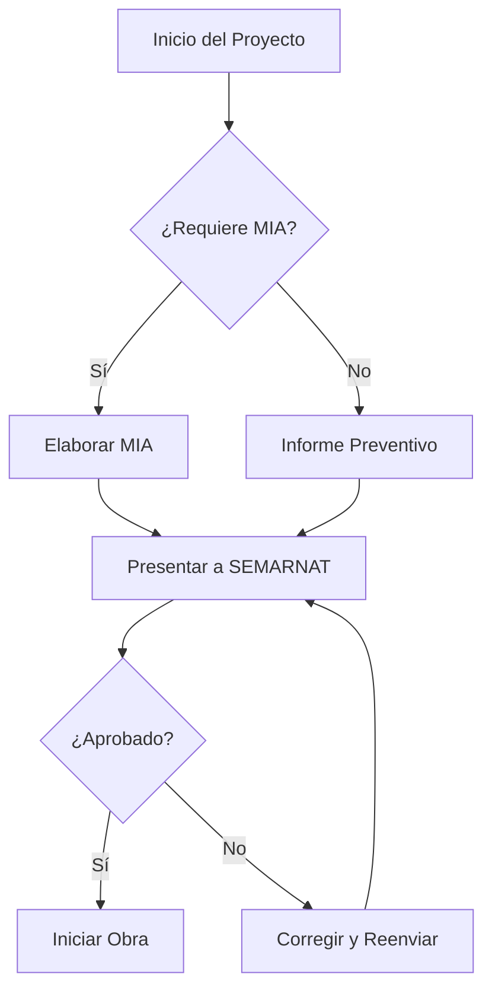

import { Callout, Embed, Figure, LinkCard } from '@/components/mdx';

Esta guía muestra **todos los elementos disponibles** para crear contenido en el blog. Úsala como referencia al escribir nuevas entradas.

## Tipografía Básica

### Encabezados

Los encabezados organizan el contenido jerárquicamente. Usa `##` para secciones principales y `###` para subsecciones.

### Formato de Texto

Puedes usar **texto en negrita** para énfasis fuerte, *texto en cursiva* para énfasis suave, y ***combinación de ambos*** cuando sea necesario.

También puedes usar `código inline` para términos técnicos, variables o comandos cortos.

Los [enlaces internos](/blog/) y [enlaces externos](https://www.gob.mx/semarnat) se formatean automáticamente. Los externos muestran un indicador ↗.

---

## Listas

### Lista sin Orden

- Evaluación de impacto ambiental
- Gestión de residuos peligrosos
- Cumplimiento normativo SEMARNAT
- Estrategias de sostenibilidad corporativa

### Lista Ordenada

1. Realizar diagnóstico inicial
2. Identificar requisitos legales aplicables
3. Desarrollar plan de acción
4. Implementar medidas correctivas
5. Monitorear y reportar resultados

### Lista Anidada

- **Fase 1: Diagnóstico**
  - Revisión documental
  - Visita de campo
  - Entrevistas con personal clave
- **Fase 2: Análisis**
  - Evaluación de riesgos
  - Identificación de brechas
- **Fase 3: Implementación**
  - Plan de acción
  - Capacitación
  - Seguimiento

---

## Citas y Destacados

> "La sostenibilidad no es solo una responsabilidad ambiental, es una ventaja competitiva que define el éxito empresarial del siglo XXI."
>
> — Principios de Inversión Responsable de la ONU

---

## Componentes MDX Personalizados

### Callout - Información

<Callout type="info">
Los criterios ESG (Environmental, Social, Governance) son cada vez más relevantes para acceder a financiamiento internacional.
</Callout>

### Callout - Consejo

<Callout type="tip" title="Recomendación">
Antes de iniciar un proyecto, verifica si requiere Manifestación de Impacto Ambiental (MIA) consultando el artículo 28 de la LGEEPA.
</Callout>

### Callout - Advertencia

<Callout type="warning">
El incumplimiento de la normatividad ambiental puede resultar en multas de hasta 50,000 UMAs y clausura de instalaciones.
</Callout>

### Callout - Importante

<Callout type="important">
Las empresas con financiamiento IFC deben cumplir con los 8 Estándares de Desempeño durante toda la vida del proyecto.
</Callout>

### Callout - Nota

<Callout type="note">
Este documento se actualizó en enero 2025 con las últimas modificaciones a la LGEEPA.
</Callout>

### LinkCard - Enlaces Destacados

<LinkCard
  href="/blog/mia-manifestacion-impacto-ambiental/"
  title="Guía MIA"
  description="Todo sobre la Manifestación de Impacto Ambiental en México"
/>

<LinkCard
  href="https://www.gob.mx/semarnat"
  title="SEMARNAT"
  description="Portal oficial de la Secretaría de Medio Ambiente"
  external
/>

---

## Tablas

### Tabla Simple

| Tipo de MIA | Proyectos | Tiempo de Resolución |
|-------------|-----------|---------------------|
| Particular | Bajo impacto | 60 días hábiles |
| Regional | Alto impacto | 120 días hábiles |

### Tabla Completa

| Estándar IFC | Tema | Requisitos Clave |
|:-------------|:-----|:-----------------|
| PS1 | Evaluación y Gestión de Riesgos | SGAS, identificación de riesgos, monitoreo |
| PS2 | Trabajo y Condiciones Laborales | Derechos laborales, salud y seguridad |
| PS3 | Eficiencia de Recursos | Agua, energía, emisiones GEI |
| PS4 | Salud y Seguridad de la Comunidad | Impactos en comunidades, emergencias |
| PS5 | Adquisición de Tierras | Reasentamiento, compensación justa |
| PS6 | Biodiversidad | Hábitats, especies en peligro |
| PS7 | Pueblos Indígenas | Consulta previa, CLPI |
| PS8 | Patrimonio Cultural | Sitios arqueológicos, protección |

---

## Código

### Código Inline

Para calcular emisiones usa la fórmula `CO2e = Actividad × Factor de Emisión`.

### Bloque de Código

```javascript
// Cálculo de huella de carbono
function calcularHuellaCarbono(consumoElectrico, factorEmision) {
  const emisionesCO2 = consumoElectrico * factorEmision;
  return {
    toneladas: emisionesCO2 / 1000,
    descripcion: `${emisionesCO2.toFixed(2)} kg CO2e`
  };
}

const resultado = calcularHuellaCarbono(15000, 0.527);
console.log(resultado);
```

### Código Python

```python
import pandas as pd

# Análisis de datos ambientales
def analizar_emisiones(datos_csv):
    df = pd.read_csv(datos_csv)

    # Calcular totales por categoría
    emisiones_totales = df.groupby('categoria')['co2e'].sum()

    return emisiones_totales.sort_values(ascending=False)

# Ejecutar análisis
resultados = analizar_emisiones('emisiones_2024.csv')
print(resultados)
```

### Código SQL

```sql
-- Consulta de cumplimiento ambiental
SELECT
    empresa,
    tipo_permiso,
    fecha_vencimiento,
    DATEDIFF(fecha_vencimiento, CURDATE()) as dias_restantes
FROM permisos_ambientales
WHERE estado = 'vigente'
  AND DATEDIFF(fecha_vencimiento, CURDATE()) <= 90
ORDER BY dias_restantes ASC;
```

---

## Imágenes

### Imagen Markdown (Simple)


### Componente Figure (Recomendado)

El componente `Figure` ofrece mejor control sobre imágenes con caption:

<Figure
  src="https://images.unsplash.com/photo-1470071459604-3b5ec3a7fe05?w=900&q=80"
  alt="Paisaje de montañas con niebla al amanecer"
  caption="Figura 1: Ecosistema de montaña - Los bosques de niebla son críticos para la captura de agua."
/>

### Figure a Ancho Completo

<Figure
  src="https://images.unsplash.com/photo-1559827291-72ee739d0d9a?w=1200&q=80"
  alt="Manglar con raíces aéreas y agua cristalina"
  caption="Figura 2: Ecosistema de manglar en la costa del Golfo de México. Los manglares protegen las costas y son viveros naturales."
  fullWidth
/>

---

## Contenido Embebido

### Componente Embed (Recomendado)

El componente `Embed` proporciona videos e iframes responsivos con estilos consistentes:

```jsx
<Embed
  src="https://www.youtube.com/embed/VIDEO_ID"
  title="Título del video"
  aspectRatio="16:9"
/>
```

### Video de YouTube

<Embed
  src="https://www.youtube.com/embed/QQYgCxu988s"
  title="Cambio Climático: Causas y Consecuencias - ONU"
/>

### Mapa Interactivo (Google Maps)

<Embed
  src="https://www.google.com/maps/embed?pb=!1m18!1m12!1m3!1d60231.33252454498!2d-86.88828565!3d21.161907549999998!2m3!1f0!2f0!3f0!3m2!1i1024!2i768!4f13.1!3m3!1m2!1s0x8f4c2b05aef653db%3A0xce32b73c625fcd8a!2sParque%20Nacional%20Costa%20Occidental%20de%20Isla%20Mujeres%2C%20Punta%20Canc%C3%BAn%20y%20Punta%20Nizuc!5e0!3m2!1ses-419!2smx!4v1704628800000!5m2!1ses-419!2smx"
  title="Parque Nacional Arrecifes de Cancún - Área Natural Protegida"
  aspectRatio="16:9"
/>

Opciones de `aspectRatio`: `16:9` (default), `4:3`, `1:1`, `9:16`

---

## Gráficas y Visualizaciones

### Gráfica con Mermaid (Diagramas de Flujo)

Para diagramas de flujo, puedes usar la sintaxis Mermaid en bloques de código:



### Gráfica de Datos (Chart.js embed)

Para gráficas interactivas, puedes crear un componente React personalizado o embeber desde herramientas como:

- **Datawrapper**: Gráficas responsivas embebibles
- **Flourish**: Visualizaciones interactivas
- **Observable**: Notebooks con D3.js

Ejemplo de embed Datawrapper:

```html
<iframe
  title="Emisiones GEI por Sector en México"
  src="https://datawrapper.dwcdn.net/CHART_ID/"
  scrolling="no"
  frameborder="0"
  style="width: 100%; border: none;"
  height="400"
></iframe>
```

---

## Fórmulas Matemáticas

Para fórmulas simples usa código inline: `E = mc²`

Para fórmulas complejas, considera usar una imagen o el formato:

**Cálculo de Factor de Emisión:**

```
FE = (Emisiones Totales) / (Actividad Total)

Donde:
- FE = Factor de Emisión (kg CO2e / unidad)
- Emisiones Totales = Suma de todas las emisiones del periodo
- Actividad Total = Producción, consumo o distancia según aplique
```

---

## Línea de Tiempo

### Cronología del Proyecto

1. **Enero 2025** — Diagnóstico inicial y recopilación de información
2. **Febrero 2025** — Elaboración de estudios de campo
3. **Marzo 2025** — Presentación de MIA a SEMARNAT
4. **Mayo 2025** — Resolución esperada
5. **Junio 2025** — Inicio de construcción

---

## Estructura de Entradas

Cada entrada es una carpeta con su contenido y assets:

```
src/content/blog/
├── mi-nueva-entrada/
│   ├── index.mdx        ← Contenido
│   ├── hero.jpg         ← Imagen destacada
│   ├── diagrama.png     ← Otras imágenes
│   └── grafica.svg
├── otra-entrada/
│   └── index.mdx
```

<Callout type="tip" title="Organización">
Cada entrada es autosuficiente. Al eliminar la carpeta, se eliminan también sus imágenes.
</Callout>

---

## Frontmatter (Metadatos)

Cada entrada debe incluir metadatos en el frontmatter:

```yaml
---
title: "Título de la entrada (máx 60 caracteres)"
description: "Descripción para SEO (120-160 caracteres)"
pubDate: 2025-01-07
category: "Sostenibilidad"  # ESG, Regulacion-Ambiental, IFC, Sostenibilidad, Estudios-Ambientales
tags: ["etiqueta1", "etiqueta2"]
draft: false          # true para borradores
featured: false       # true para destacar

# Imagen destacada (opcional)
heroImage: ./hero.jpg
heroImageAlt: "Descripción de la imagen para accesibilidad"

# SEO avanzado (opcional)
updatedDate: 2025-02-15
canonicalUrl: https://ejemplo.com/url-canonica
noindex: false
---
```

<Callout type="info" title="Imagen Destacada">
La imagen `heroImage` aparece como thumbnail en la lista de entradas y como hero en el artículo. Usa rutas relativas (`./hero.jpg`) a la carpeta de la entrada.
</Callout>

---

## Resumen

Esta guía cubre los principales elementos disponibles:

| Elemento | Uso |
|----------|-----|
| **heroImage** | Imagen destacada (thumbnail + hero) |
| **Encabezados** | Organizar secciones (##, ###) |
| **Listas** | Enumerar puntos clave |
| **Tablas** | Datos comparativos |
| **Código** | Ejemplos técnicos |
| **Callouts** | Destacar información importante |
| **LinkCards** | Enlaces relevantes |
| **Figure** | Imágenes con caption |
| **Embed** | Videos y mapas responsivos |

<Callout type="tip" title="¿Necesitas ayuda?">
Si requieres un componente adicional para tu contenido, contacta al equipo de desarrollo para evaluar su implementación.
</Callout>

---

*Última actualización: Enero 2025*
